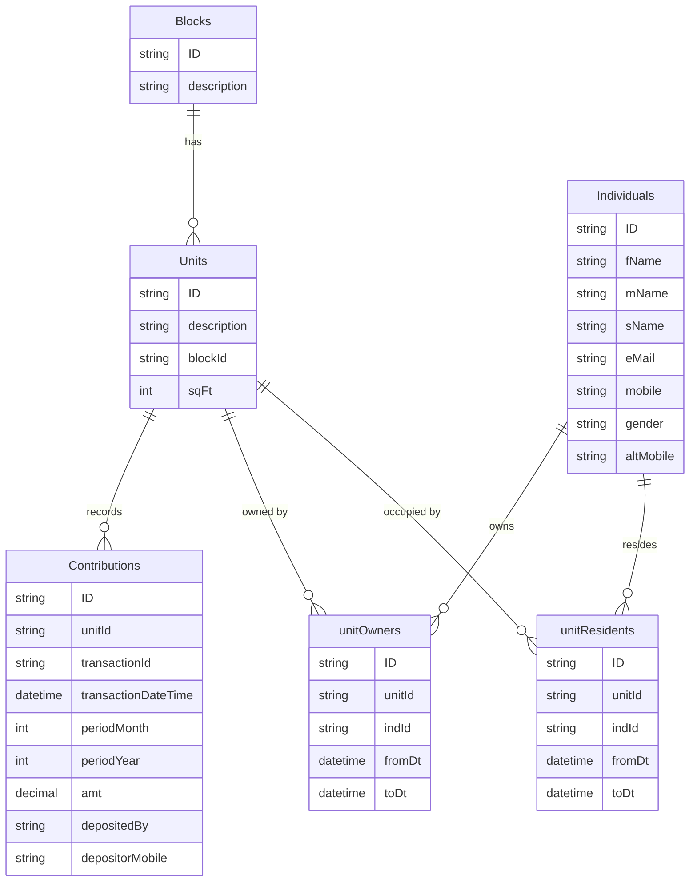

```mermaid
erDiagram

    %% ============================
    %% Core Entities
    %% ============================

    Blocks {
        string ID
        string description
    }

    Units {
        string ID
        string description
        string blockId
        int sqFt
    }

    Individuals {
        string ID
        string fName
        string mName
        string sName
        string eMail
        string mobile
        string gender
        string altMobile
    }

    %% periodMonth = 1–12
    %% periodYear = YYYY

    Contributions {
        string ID
        string unitId
        string transactionId
        datetime transactionDateTime
        int periodMonth
        int periodYear
        decimal amt
        string depositedBy
        string depositorMobile
    }

    unitOwners {
        string ID
        string unitId
        string indId
        datetime fromDt
        datetime toDt
    }

    unitResidents {
        string ID
        string unitId
        string indId
        datetime fromDt
        datetime toDt
    }

    Blocks ||--o{ Units : "has"

    Units ||--o{ Contributions : "records"

    Individuals ||--o{ unitOwners : "owns"
    Units ||--o{ unitOwners : "owned by"

    Individuals ||--o{ unitResidents : "resides"
    Units ||--o{ unitResidents : "occupied by"
```
