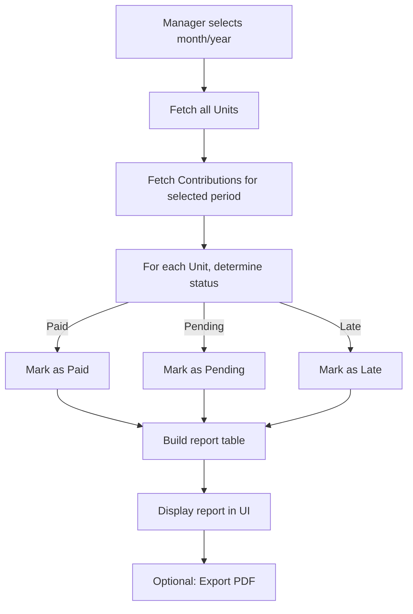

```mermaid
flowchart TD

    A[Manager selects month/year] --> B[Fetch all Units]

    B --> C[Fetch Contributions for selected period]

    C --> D[For each Unit, determine status]

    D -->|Paid| E1[Mark as Paid]
    D -->|Pending| E2[Mark as Pending]
    D -->|Late| E3[Mark as Late]

    E1 --> F[Build report table]
    E2 --> F
    E3 --> F

    F --> G[Display report in UI]
    G --> H[Optional: Export PDF]
```
