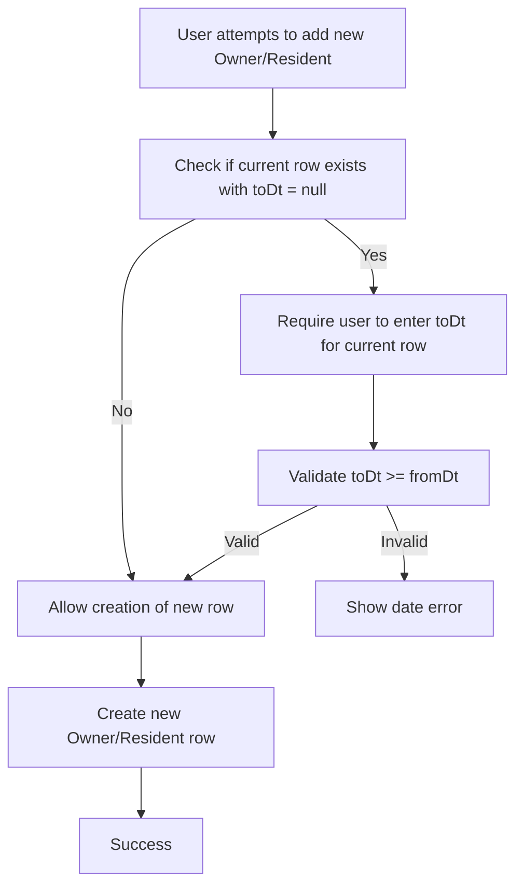

```mermaid
flowchart TD

    A[User attempts to add new Owner/Resident] --> B[Check if current row exists with toDt = null]

    B -->|Yes| C[Require user to enter toDt for current row]
    B -->|No| D[Allow creation of new row]

    C --> E[Validate toDt >= fromDt]
    E -->|Valid| D
    E -->|Invalid| F[Show date error]

    D --> G[Create new Owner/Resident row]
    G --> H[Success]
```
