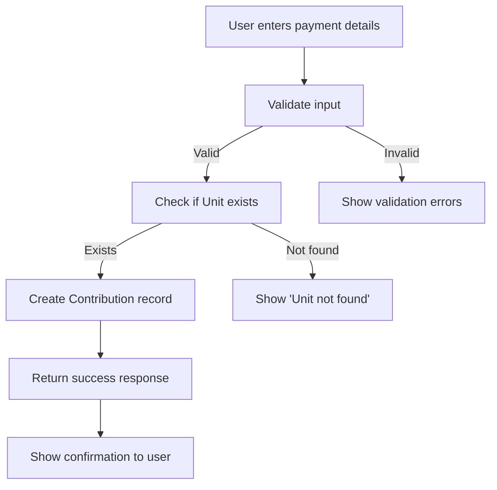

```mermaid
flowchart TD

    A[User enters payment details] --> B[Validate input]

    B -->|Valid| C[Check if Unit exists]
    B -->|Invalid| Z[Show validation errors]

    C -->|Exists| D[Create Contribution record]
    C -->|Not found| Y[Show 'Unit not found']

    D --> E[Return success response]
    E --> F[Show confirmation to user]
```
