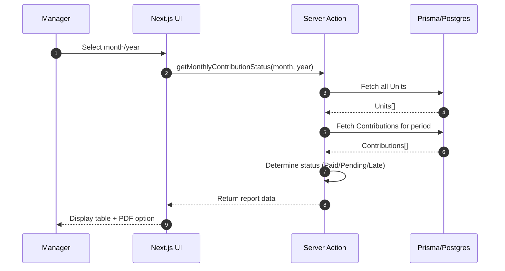

```mermaid
sequenceDiagram
    autonumber

    participant M as Manager
    participant UI as Next.js UI
    participant SA as Server Action
    participant DB as Prisma/Postgres

    M->>UI: Select month/year
    UI->>SA: getMonthlyContributionStatus(month, year)

    SA->>DB: Fetch all Units
    DB-->>SA: Units[]

    SA->>DB: Fetch Contributions for period
    DB-->>SA: Contributions[]

    SA->>SA: Determine status (Paid/Pending/Late)

    SA-->>UI: Return report data
    UI-->>M: Display table + PDF option
```
