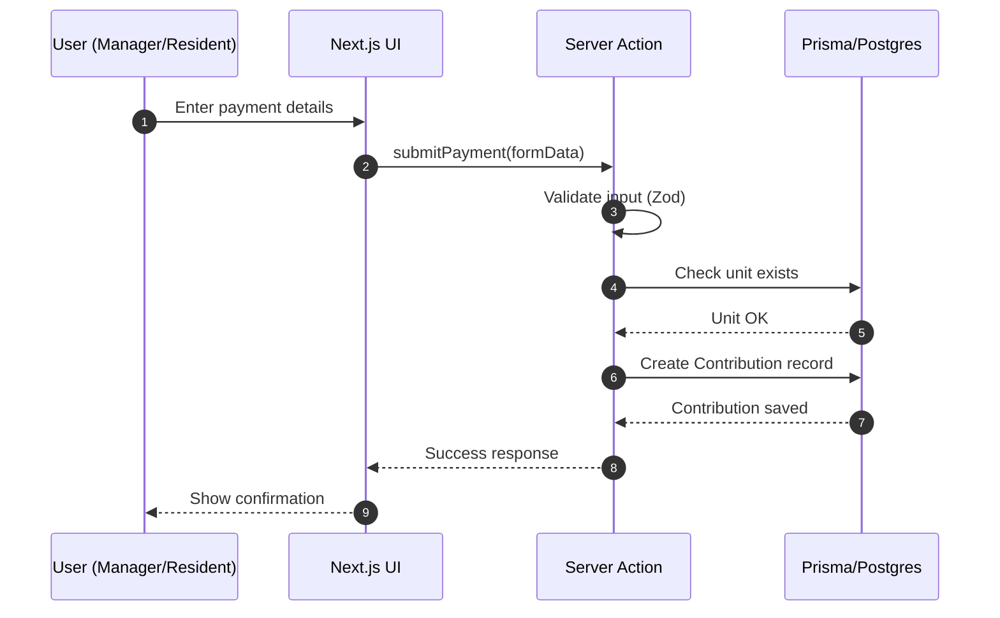

```mermaid
sequenceDiagram
    autonumber

    participant U as User (Manager/Resident)
    participant UI as Next.js UI
    participant SA as Server Action
    participant DB as Prisma/Postgres

    U->>UI: Enter payment details
    UI->>SA: submitPayment(formData)

    SA->>SA: Validate input (Zod)
    SA->>DB: Check unit exists
    DB-->>SA: Unit OK

    SA->>DB: Create Contribution record
    DB-->>SA: Contribution saved

    SA-->>UI: Success response
    UI-->>U: Show confirmation
```
